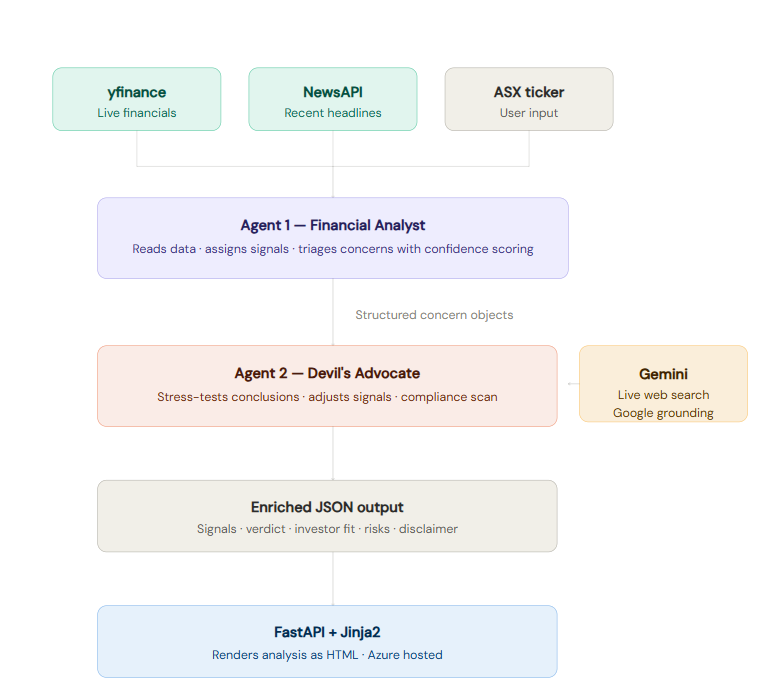

# ASX Intel

### AI-Powered Financial Intelligence for ASX-Listed Stocks

*Enter any ASX ticker. Two AI agents analyse the financials, stress-test each other's conclusions with live web search, and return a plain-English verdict.*

---

## Pipeline

Two agents. One verdict. Agent 1 analyses the financials and triages concerns with confidence scoring. Agent 2 receives those structured concern objects, runs live Gemini web search, stress-tests Agent 1's conclusions, and runs a compliance check — before any output reaches the user.

---

## Why two agents

Most AI tools use a single prompt to do everything. ASX Intel separates analysis from validation — the same pattern a senior analyst uses to pressure-test a junior's work before it goes to a client.

Agent 1 forms a view from the data. Agent 2 challenges it with real-world evidence. Neither agent does the other's job.

---

## Why native Python orchestration

CrewAI was evaluated and rejected. It makes 4–6 hidden API calls per execution on top of the two agent calls — consistently hitting the Anthropic rate limit. Native Python orchestration replaced it: exactly two Claude calls per analysis, full control over every API call, no hidden overhead.

---

## Tech stack

| Component | Technology | Notes |
|---|---|---|
| LLM — both agents | Anthropic Claude Haiku | Deterministic signal output |
| Web search | Gemini Flash + Google grounding | Batched — one call covers all flagged concerns |
| Financial data | yfinance | ASX-compatible via .AX suffix tickers |
| News | NewsAPI | Free tier — replacement planned |
| Orchestration | Native Python | CrewAI evaluated and rejected |
| Backend | FastAPI + Jinja2 | Decoupled from presentation layer |
| Deployment | Azure App Service B1 | Australia East · GitHub Actions CI/CD |
| Language | Python 3.11 | — |

---

## Known limitations

- **Analysis time:** 40–55 seconds. Two sequential Claude calls plus Gemini web search. Async parallelisation is the planned fix.
- **Fundamentals lag:** yfinance returns the most recent annual or semi-annual filing — up to 12 months old for some ASX companies.
- **News relevance:** NewsAPI free tier search is broad, not company-specific. A dedicated ASX announcements feed is planned.
- **Concurrency:** Single Azure B1 instance. Concurrent users queue.

---

## Note on this repository

This is the public portfolio repository. The `prompts/` directory — which contains the agent prompt architecture — is excluded. The full production codebase including both agent prompts is in a separate private repository.

---

## Disclaimer

This tool provides general financial information only and does not constitute financial advice. Always verify against ASX announcements and consult a licensed financial adviser before making investment decisions.

---

Built by Shyam &nbsp;·&nbsp; [Beyond the Config](https://open.substack.com/pub/itzshyam) &nbsp;·&nbsp; [LinkedIn](https://linkedin.com/in/itzshyam)

